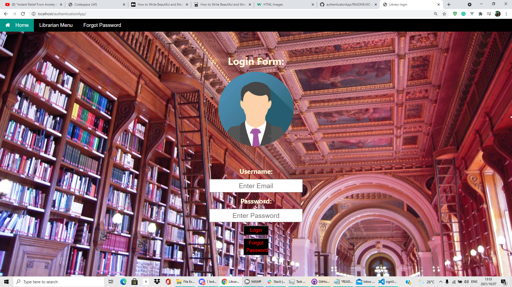

<h1>Library Database</h1>
<h2>When you first start the app you will come across this screen:</h2>
 

 
<h2>If you are a new customer and want to sign up for an account. You must consult the librarian for only he/she can create new accounts

<h2>In order for the librarians to create new accounts using the "Librarian Menu". Once clicked on this menu will appear.
 
.
 
<h2>Librians need to login with their special password in order to create accounts.After that a similiar menu will appear and after the details have been filled in the new account will be add to the database.</h2>
 
<h2>This is the "Forgot Password" tab. It can be accessed by clicking on the tab of ths.</h2>
 

 
<h2> Once logged in user's will come across this menu.</h2>
 

 
<h2>Once inside customer's can search for books, except their authors. Only librarians can search for authors. There are also sort buttons that the user can use to filter content.

